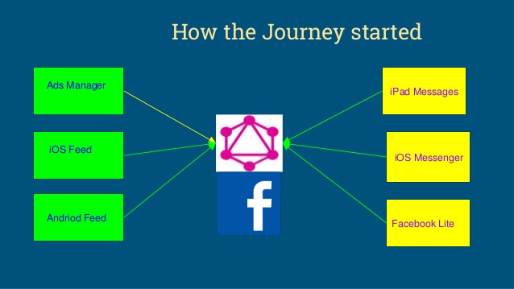

---?image=assets/img/graphql-long.png

---?include=assets/md/examples/followers.md

---?include=assets/md/examples/likes.md

---?include=assets/md/examples/databases.md
+++?include=assets/md/examples/magento.md

---?include=assets/md/motivation/problems.md

---?include=assets/md/motivation/problems-image.md

---?@snap[midpoint span-100]

@snapend

---?include=assets/md/features/features.md

---?include=assets/md/features/width.md

---?include=assets/md/features/device-width.md

---?include=assets/md/features/device-height.md

---?include=assets/md/features/orientation.md

---?include=assets/md/features/aspect-ratio.md

---?include=assets/md/features/device-aspect-ratio.md

---?include=assets/md/features/color.md

---?include=assets/md/features/color-index.md

---?include=assets/md/features/monochrome.md

---?include=assets/md/features/resolution.md

---?include=assets/md/features/scan.md

---?include=assets/md/features/grid.md

---?include=assets/md/error-handling/error-handling.md

---?include=assets/md/error-handling/unknown-media-feature.md
+++?include=assets/md/error-handling/unknown-media-feature-values.md
+++?include=assets/md/error-handling/malformed-media-query.md

---?include=assets/md/improvements/breakpoints.md
+++?include=assets/md/improvements/screens-approach.md
+++?include=assets/md/improvements/visitors-approach.md
+++?include=assets/md/improvements/visitors-approach.md
+++?include=assets/md/improvements/content-approach.md

---?include=assets/md/improvements/progressive-enhancement.md

---?image=assets/img/boring.jpg

@snap[north span-100 h2-red]
## Thank you for your attention
@snapend
